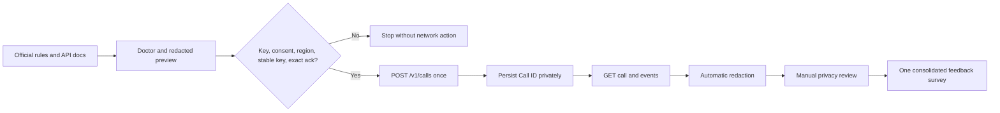

# Evidence workflow

## Components

- `src/lab.mjs` owns validation, the consent gate, request construction, direct HTTP
  transport, error preservation and redaction.
- `src/cli.mjs` exposes doctor, preview, guarded create and read-only status commands.
- `.local/run.json` stores the Call ID and idempotency recovery state with private
  file permissions. The directory is ignored.
- `evidence/` contains sanitized records only and still requires manual review.
- `test/` uses local mock servers. Passing tests establish harness behavior only.
- `submission/REPORT.md` is the single source for feedback-form drafting.

The harness uses Node's native `fetch`; no runtime dependency or application database
is required. A non-official base URL is rejected unless the explicit local-test
override is present, which keeps mock tests separate from the live path.
